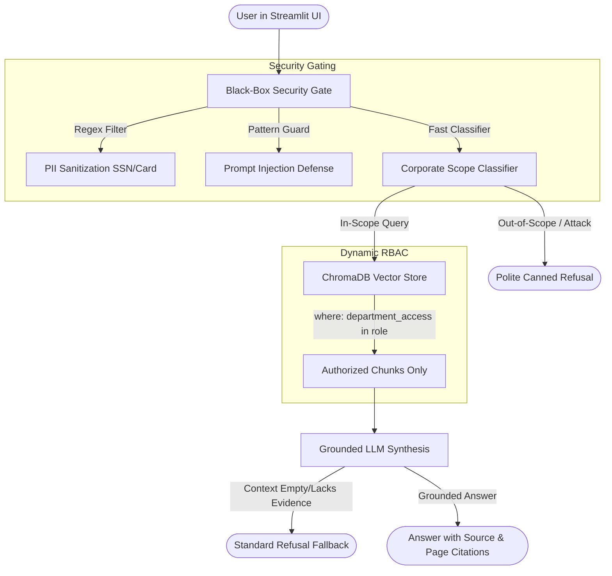

# Enterprise Guardrailed Multi-Department RAG System

[](https://www.python.org/downloads/)
[](https://streamlit.io/)
[](https://www.trychroma.com/)
[](tests/)

An enterprise-grade, guardrailed Retrieval-Augmented Generation (RAG) system with strict **Role-Based Access Control (RBAC)** across multi-departmental document repositories (`Engineering`, `Finance`, `Public`), black-box **Chipotle-style security guardrails**, and an interactive **Ragas Evaluation Dashboard**.

---

## Key Architecture & Features



1. **Document Ingestion & Chunking**:
   * Parsed with **Docling** and PyPDF into **600-token chunks** with **120-token sliding overlap**.
   * Strictly enforces mandatory chunk metadata: `department_access`, `source_file`, and `page_number` (Constitution Principle III).
2. **Dynamic RBAC Retrieval**:
   * Pre-filters vector search at the ChromaDB index level by active user role:
     * `Public` → `['Public']`
     * `Finance-Manager` → `['Finance', 'Public']`
     * `Engineering-Lead` → `['Engineering', 'Public']`
     * `Admin` → `['Engineering', 'Finance', 'Public']`
   * Guarantees **0% cross-department unauthorized data leakage** (SC-001).
3. **Black-Box Guardrails & Scope Enforcement**:
   * Redacts sensitive PII (SSN, credit cards).
   * Intercepts prompt injection attacks.
   * Classifies out-of-scope queries (general coding, trivia, casual advice) and returns polite canned refusal without expensive LLM generation or hallucination.
4. **Strict Groundedness**:
   * All responses cite source files and exact page numbers (`[Doc: <file>, Page: <page>]`).
   * Returns standardized fallback (*"I do not have sufficient information in the authorized corporate documents to answer this question."*) when context is ungrounded.
5. **Interactive UI & Ragas Dashboard (Streamlit + Plotly)**:
   * **Tab 1**: Conversational chat with citation cards and collapsible chunk previews.
   * **Tab 2**: Visual evaluation analytics rendering Plotly bar charts of Ragas metrics (**Faithfulness**, **Answer Relevance**, **Context Recall**).

---

## Quickstart

### 1. Installation
```bash
# Clone and enter directory
cd my-adv-rag

# Create virtualenv and install dependencies
uv venv .venv
source .venv/bin/activate
uv pip install -r requirements.txt
```

### 2. Configure Environment
```bash
cp .env.example .env
# Add your GEMINI_API_KEY or OPENAI_API_KEY (optional for local mock execution)
```

### 3. Run Automated Test Suite
```bash
pytest tests/ -v
```

### 4. Run Offline Benchmark Suite
```bash
python -m src.eval.benchmark_runner --dataset data/eval/golden_dataset.json --output data/eval/eval_results.json
```

### 5. Launch Streamlit Application
```bash
streamlit run app.py
```

---

## Project Structure

```text
.
├── app.py                    # Streamlit Multi-Tab Dashboard
├── data/
│   ├── engineering/          # Engineering documents
│   ├── finance/              # Confidential finance documents
│   ├── public/               # Public documents
│   ├── eval/                 # Golden datasets & benchmark results
│   └── chroma_db/            # Local ChromaDB persistent store
├── src/
│   ├── config/settings.py    # Pydantic Settings
│   ├── models/               # Domain, security, query & eval schemas
│   ├── ingestion/            # Docling parser, chunker, & pipeline
│   ├── retrieval/            # ChromaDB RBAC vector store & retriever
│   ├── security/             # PII sanitizer, injection guard, guardrails
│   ├── generation/           # Grounded prompts & LLM generator
│   ├── engine/               # RAG orchestrator pipeline
│   └── eval/                 # Ragas metrics & CLI benchmark runner
└── tests/                    # 16 unit, RBAC, and integration tests
```
