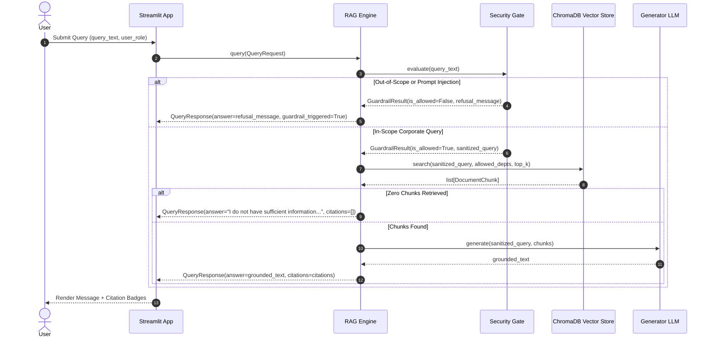

# Interface Contract: RAG Engine

**Component**: `src.engine.rag_pipeline` | **Type**: Python Core Service

---

## 1. Overview

The `RAGEngine` orchestrates the complete guardrailed query lifecycle: query sanitation, guardrail verification, RBAC vector retrieval from ChromaDB, grounded prompt assembly, and LLM answer generation with citation mapping.

---

## 2. Public API Interface

```python
class RAGEngine:
    def __init__(self, config: Settings, vector_store: VectorStoreService, llm_service: LLMService):
        """Initializes RAG Engine with dependency-injected services."""
        ...

    def query(self, request: QueryRequest) -> QueryResponse:
        """
        Executes end-to-end query workflow synchronously.
        
        Args:
            request: QueryRequest containing query_text, user_role, and top_k.
            
        Returns:
            QueryResponse with generated answer, citations, and execution latency.
        """
        ...

    async def aquery_stream(self, request: QueryRequest) -> AsyncGenerator[str, None]:
        """
        Streams generated response chunks for conversational UI rendering.
        """
        ...
```

---

## 3. Workflow Sequence


