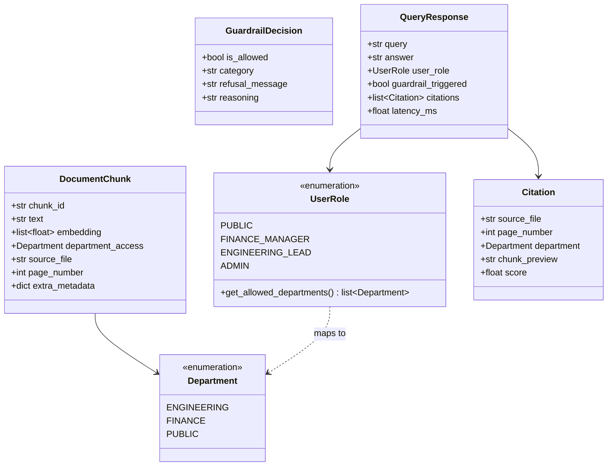

# Data Model: Enterprise Guardrailed Multi-Department RAG System

**Feature**: `001-enterprise-guardrailed-rag` | **Date**: 2026-08-28

This document defines the core Pydantic domain models, metadata schemas, and validation rules adhering to the project Constitution (Principle II and Principle III).

---

## 1. Core Domain Entities



---

## 2. Pydantic Schemas

### A. Document Schemas (`src/models/document.py`)

```python
from enum import Enum
from pydantic import BaseModel, Field
from typing import Optional, List, Dict, Any

class Department(str, Enum):
    ENGINEERING = "Engineering"
    FINANCE = "Finance"
    PUBLIC = "Public"

class ChunkMetadata(BaseModel):
    department_access: Department = Field(
        ..., 
        description="Department authorized to view this chunk (Constitutional requirement)"
    )
    source_file: str = Field(
        ..., 
        description="Original source filename or path (Constitutional requirement)"
    )
    page_number: int = Field(
        ..., 
        ge=1, 
        description="Physical page number of the source document (Constitutional requirement)"
    )
    extra: Dict[str, Any] = Field(default_factory=dict)

class DocumentChunk(BaseModel):
    chunk_id: str = Field(..., description="Unique deterministic identifier (hash of content + source + page)")
    text: str = Field(..., min_length=1, description="Raw chunk text (600 tokens approx)")
    metadata: ChunkMetadata
```

### B. User Role & Security Schemas (`src/models/security.py`)

```python
from enum import Enum
from typing import List, Optional
from pydantic import BaseModel, Field
from src.models.document import Department

class UserRole(str, Enum):
    PUBLIC = "Public"
    FINANCE_MANAGER = "Finance-Manager"
    ENGINEERING_LEAD = "Engineering-Lead"
    ADMIN = "Admin"

    def allowed_departments(self) -> List[Department]:
        if self == UserRole.PUBLIC:
            return [Department.PUBLIC]
        elif self == UserRole.FINANCE_MANAGER:
            return [Department.FINANCE, Department.PUBLIC]
        elif self == UserRole.ENGINEERING_LEAD:
            return [Department.ENGINEERING, Department.PUBLIC]
        elif self == UserRole.ADMIN:
            return [Department.ENGINEERING, Department.FINANCE, Department.PUBLIC]
        return [Department.PUBLIC]

class GuardrailCategory(str, Enum):
    IN_SCOPE = "in_scope"
    OUT_OF_SCOPE = "out_of_scope"
    PROMPT_INJECTION = "prompt_injection"
    PII_DETECTED = "pii_detected"

class GuardrailResult(BaseModel):
    is_allowed: bool
    category: GuardrailCategory
    refusal_message: Optional[str] = None
    sanitized_query: str
    reasoning: Optional[str] = None
```

### C. RAG Query & Citation Schemas (`src/models/query.py`)

```python
from pydantic import BaseModel, Field
from typing import List, Optional
from src.models.document import Department
from src.models.security import UserRole

class Citation(BaseModel):
    source_file: str
    page_number: int
    department: Department
    chunk_preview: str
    score: Optional[float] = None

class QueryRequest(BaseModel):
    query_text: str = Field(..., min_length=1)
    user_role: UserRole = Field(default=UserRole.PUBLIC)
    top_k: int = Field(default=4, ge=1, le=10)

class QueryResponse(BaseModel):
    query: str
    answer: str
    user_role: UserRole
    is_refusal: bool = False
    guardrail_triggered: bool = False
    citations: List[Citation] = Field(default_factory=list)
    latency_ms: float
```

### D. Offline Evaluation Schemas (`src/models/evaluation.py`)

```python
from pydantic import BaseModel, Field
from typing import List, Dict, Any, Optional

class EvalSample(BaseModel):
    question_id: str
    question: str
    ground_truth: str
    department: str
    contexts: List[str]
    answer: str
    faithfulness: float = Field(..., ge=0.0, le=1.0)
    answer_relevance: float = Field(..., ge=0.0, le=1.0)
    context_recall: float = Field(..., ge=0.0, le=1.0)

class BenchmarkReport(BaseModel):
    timestamp: str
    total_samples: int
    mean_faithfulness: float
    mean_answer_relevance: float
    mean_context_recall: float
    by_department: Dict[str, Dict[str, float]]
    samples: List[EvalSample]
```

---

## 3. Validation Invariants

1. **Constitutional Metadata Guard**: No chunk may be written to ChromaDB unless `department_access`, `source_file`, and `page_number >= 1` are present and valid.
2. **Deterministic Role Filter**: Every vector search query MUST generate a `where` clause matching `user_role.allowed_departments()`.
3. **Immutability of Chunks**: `chunk_id` is computed using a deterministic SHA-256 hash of `(source_file, page_number, chunk_index, text)` to prevent duplicate ingestion.
